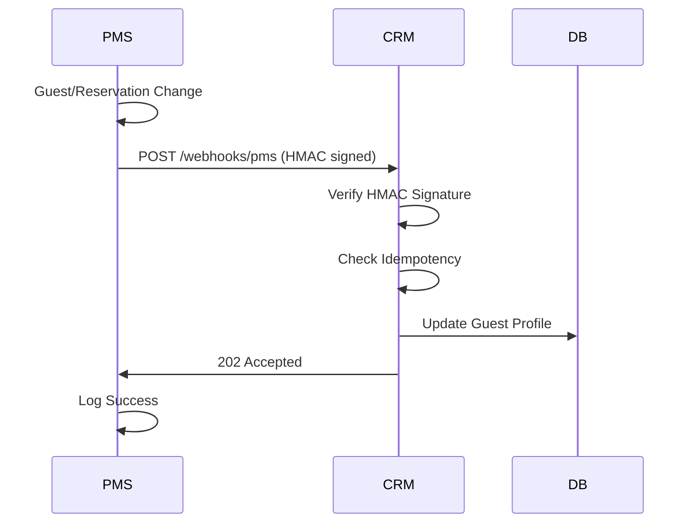

# Webhook Example Monorepo

[](https://nodejs.org/)
[](https://www.typescriptlang.org/)
[](https://www.mysql.com/)
[](https://www.docker.com/)

Monorepo ini berisi implementasi lengkap sistem integrasi **PMS (Property Management System)** dan **CRM (Customer Relationship Management)** menggunakan **webhook** untuk sinkronisasi data real-time.

## 🎯 Fitur Utama

- ✅ **Webhook Integration**: Sinkronisasi otomatis antara PMS dan CRM
- ✅ **HMAC Security**: Verifikasi signature untuk keamanan webhook
- ✅ **Idempotency**: Mencegah duplikasi event
- ✅ **Circuit Breaker**: Resilience pattern untuk handling failure
- ✅ **Rich Guest Profiles**: Agregasi data tamu dari multiple sources
- ✅ **Audit Logging**: Complete audit trail untuk compliance
- ✅ **Docker Support**: Containerized deployment
- ✅ **TypeScript**: Type-safe development
- ✅ **Database Migrations**: Versioned schema management

---

## 📁 Struktur Direktori

```
webhook-example/
├── crm-service/                 # CRM Service
│   ├── src/
│   │   ├── modules/
│   │   │   ├── events/         # Event logging & audit
│   │   │   ├── guest_profiles/ # Rich guest profile management
│   │   │   └── webhooks/       # Webhook receiver & processing
│   │   ├── config/             # Database, env, logger config
│   │   ├── domain/             # Entity definitions
│   │   ├── shared/             # Shared utilities
│   │   └── db/                 # Migrations & database scripts
│   ├── .env.example           # Environment template
│   └── package.json
├── pms-service/                # PMS Service
│   ├── src/
│   │   ├── modules/
│   │   │   ├── guests/         # Guest management
│   │   │   └── reservations/   # Reservation management
│   │   ├── shared/             # Webhook emitter & utilities
│   │   └── db/                 # Migrations & database scripts
│   ├── .env.example           # Environment template
│   └── package.json
├── docker/                     # Docker configuration
│   ├── Dockerfile             # Multi-stage build
│   └── mysql/
│       └── init.sql           # Database initialization
├── docker-compose.yml         # Development environment
├── package.json               # Monorepo root scripts
├── .gitignore                # Comprehensive ignore patterns
└── README.md                 # This file
```

---

## 🔄 Mekanisme Webhook

### Flow Integrasi



### 1. Trigger Event di PMS
Setiap perubahan data (create/update/delete) pada guest atau reservation akan trigger webhook:

```typescript
// Example: Guest created
await emitToCRM({
  type: "guest.created",
  idempotency_key: randomUUID(),
  timestamp: Date.now(),
  payload: guestData
});
```

### 2. Pengiriman Webhook
PMS mengirim HTTP POST dengan:
- **HMAC Signature**: SHA256 hash dari payload + secret
- **Idempotency Key**: UUID untuk mencegah duplikasi
- **Timestamp**: Unix timestamp untuk freshness check
- **Payload**: Data perubahan

### 3. Validasi di CRM
CRM melakukan validasi:
- ✅ **Signature Verification**: HMAC check
- ✅ **Timestamp Freshness**: Within 30 minutes
- ✅ **Idempotency**: Check duplicate events
- ✅ **Payload Schema**: Zod validation

### 4. Processing & Audit
- Update guest profile dengan data terbaru
- Log event untuk audit trail
- Handle errors dengan circuit breaker

---

## 🚀 Quick Start

### Prerequisites
- Node.js 18+
- MySQL 8.0+
- Docker & Docker Compose (optional)

### Setup Development

1. **Clone repository**
   ```bash
   git clone https://github.com/your-org/webhook-example.git
   cd webhook-example
   ```

2. **Install dependencies**
   ```bash
   npm run install:all
   # atau manual:
   # cd crm-service && npm install
   # cd ../pms-service && npm install
   ```

3. **Setup environment**
   ```bash
   cp crm-service/.env.example crm-service/.env
   cp pms-service/.env.example pms-service/.env
   # Edit .env files dengan konfigurasi database Anda
   ```

4. **Setup database**
   ```bash
   # Jalankan MySQL dan buat databases
   mysql -u root -p
   CREATE DATABASE crm_db;
   CREATE DATABASE pms_db;
   ```

5. **Run migrations**
   ```bash
   npm run db:migrate
   # atau manual:
   # cd crm-service && npm run db:migrate
   # cd ../pms-service && npm run db:migrate
   ```

6. **Start services**
   ```bash
   npm run dev
   # atau manual di terminal terpisah:
   # cd crm-service && npm run dev
   # cd pms-service && npm run dev
   ```

### Using Docker

```bash
# Start all services
docker-compose up -d

# View logs
docker-compose logs -f

# Stop services
docker-compose down
```

---

## 📡 API Endpoints

### PMS Service (Port 4001)

```bash
# Health check
GET /api/v1/health

# Guest management
GET    /api/v1/guests
POST   /api/v1/guests
GET    /api/v1/guests/:id
PUT    /api/v1/guests/:id
DELETE /api/v1/guests/:id

# Reservation management
GET    /api/v1/reservations
POST   /api/v1/reservations
GET    /api/v1/reservations/:id
PUT    /api/v1/reservations/:id
DELETE /api/v1/reservations/:id

# Webhook status
GET    /api/v1/guests/webhook/status
```

### CRM Service (Port 5001)

```bash
# Health check
GET /api/v1/health

# Event audit
GET /api/v1/events

# Guest profiles
GET /api/v1/guest-profiles

# Webhook receiver
POST /api/v1/webhooks/pms
```

---

## 🔧 Konfigurasi Environment

### CRM Service (.env)
```bash
APP_PORT=5001
APP_BASE_PATH=/api/v1
DB_HOST=localhost
DB_PORT=3306
DB_USER=crm_user
DB_PASS=crm_password
DB_NAME=crm_db
WEBHOOK_SHARED_SECRET=supersecret-shared-key
WEBHOOK_MAX_SKEW_SECONDS=1800
```

### PMS Service (.env)
```bash
APP_PORT=4001
APP_BASE_PATH=/api/v1
DB_HOST=localhost
DB_PORT=3306
DB_USER=pms_user
DB_PASS=pms_password
DB_NAME=pms_db
CRM_WEBHOOK_URL=http://localhost:5001/api/v1/webhooks/pms
CRM_WEBHOOK_SECRET=supersecret-shared-key
```

---

## 🧪 Testing Webhook

### 1. Create Guest di PMS
```bash
curl -X POST http://localhost:4001/api/v1/guests \
  -H "Content-Type: application/json" \
  -d '{
    "email": "john@example.com",
    "name": "John Doe",
    "phone": "+1234567890",
    "date_of_birth": "1990-01-01",
    "country": "USA"
  }'
```

### 2. Verifikasi Webhook di CRM
```bash
# Check events
curl http://localhost:5001/api/v1/events

# Check guest profiles
curl http://localhost:5001/api/v1/guest-profiles
```

### 3. Update Guest
```bash
curl -X PUT http://localhost:4001/api/v1/guests/1 \
  -H "Content-Type: application/json" \
  -d '{
    "name": "John Smith"
  }'
```

---

## 🏗️ Architecture

### Tech Stack
- **Runtime**: Node.js 18+
- **Language**: TypeScript 5.0+
- **Framework**: Express.js
- **Database**: MySQL 8.0+ with TypeORM
- **Validation**: Zod schemas
- **Security**: Helmet, CORS, HMAC
- **Logging**: Pino
- **Container**: Docker

### Design Patterns
- **Repository Pattern**: Data access abstraction
- **Service Layer**: Business logic encapsulation
- **Middleware Pattern**: Request/response processing
- **Observer Pattern**: Event-driven webhook system
- **Circuit Breaker**: Failure resilience

### Database Schema

#### PMS Database
- `guests`: Guest information
- `reservations`: Reservation data

#### CRM Database
- `events`: Webhook event audit log
- `guest_profiles`: Aggregated guest data

---

## 📊 Monitoring & Observability

### Health Checks
```bash
# PMS Health
curl http://localhost:4001/api/v1/health

# CRM Health
curl http://localhost:5001/api/v1/health
```

### Webhook Status
```bash
# PMS Webhook Status
curl http://localhost:4001/api/v1/guests/webhook/status
```

### Logs
- Application logs menggunakan Pino
- Database query logs (development only)
- Webhook delivery logs dengan correlation IDs

---

## 🔒 Security

- **HMAC Signature**: SHA256 untuk webhook authentication
- **Idempotency Keys**: UUID untuk mencegah replay attacks
- **Timestamp Validation**: Freshness check dalam 30 menit
- **Input Validation**: Zod schemas untuk type safety
- **SQL Injection Protection**: TypeORM parameterized queries
- **Rate Limiting**: Configurable per endpoint
- **CORS**: Configured untuk cross-origin requests

---

## 🚀 Deployment

### Production Checklist
- [ ] Update `.env` dengan production values
- [ ] Setup database users dengan minimal privileges
- [ ] Configure reverse proxy (nginx)
- [ ] Setup SSL certificates
- [ ] Configure monitoring (Prometheus/Grafana)
- [ ] Setup log aggregation
- [ ] Configure backup strategy
- [ ] Setup CI/CD pipeline

### Docker Production
```bash
# Build images
docker-compose -f docker-compose.prod.yml build

# Deploy
docker-compose -f docker-compose.prod.yml up -d
```

---

## 🤝 Contributing

1. Fork repository
2. Create feature branch (`git checkout -b feature/amazing-feature`)
3. Commit changes (`git commit -m 'Add amazing feature'`)
4. Push to branch (`git push origin feature/amazing-feature`)
5. Open Pull Request

### Development Guidelines
- Use TypeScript untuk type safety
- Follow ESLint configuration
- Write tests untuk new features
- Update documentation
- Use conventional commits

---

## 📝 License

This project is licensed under the ISC License - see the [LICENSE](LICENSE) file for details.

---

## 📞 Support

For questions or support:
- Create GitHub Issue
- Check documentation
- Review webhook logs

---

## 🔄 Roadmap

### Phase 2 Features
- [ ] Rate limiting per client
- [ ] Webhook dashboard UI
- [ ] Advanced retry strategies
- [ ] Multi-region deployment
- [ ] GraphQL API
- [ ] Real-time notifications

### Future Enhancements
- [ ] Machine learning untuk guest insights
- [ ] Advanced analytics dashboard
- [ ] Mobile app companion
- [ ] Third-party integrations
- [ ] Advanced security features
